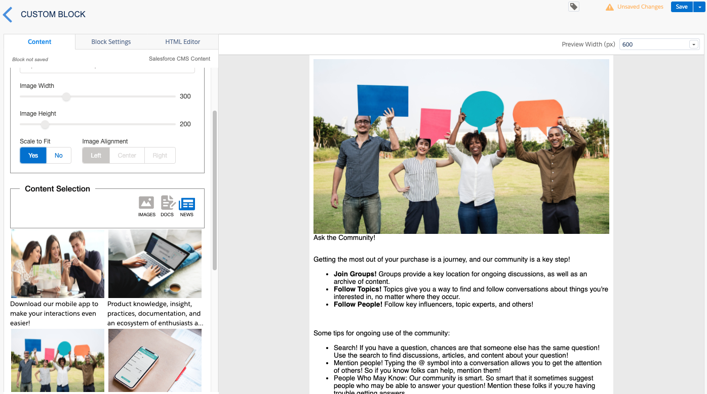
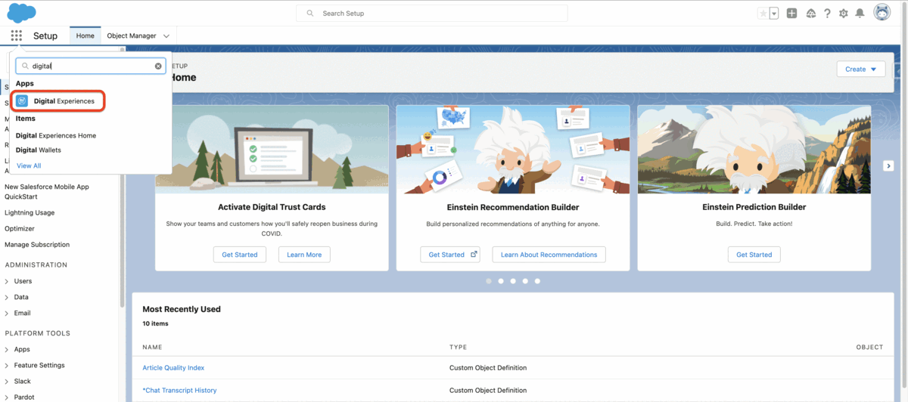
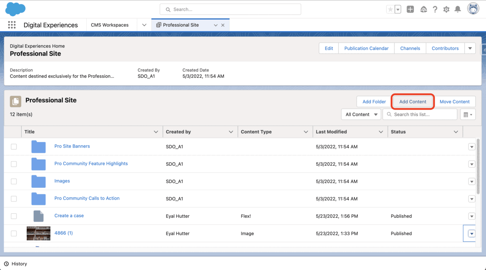
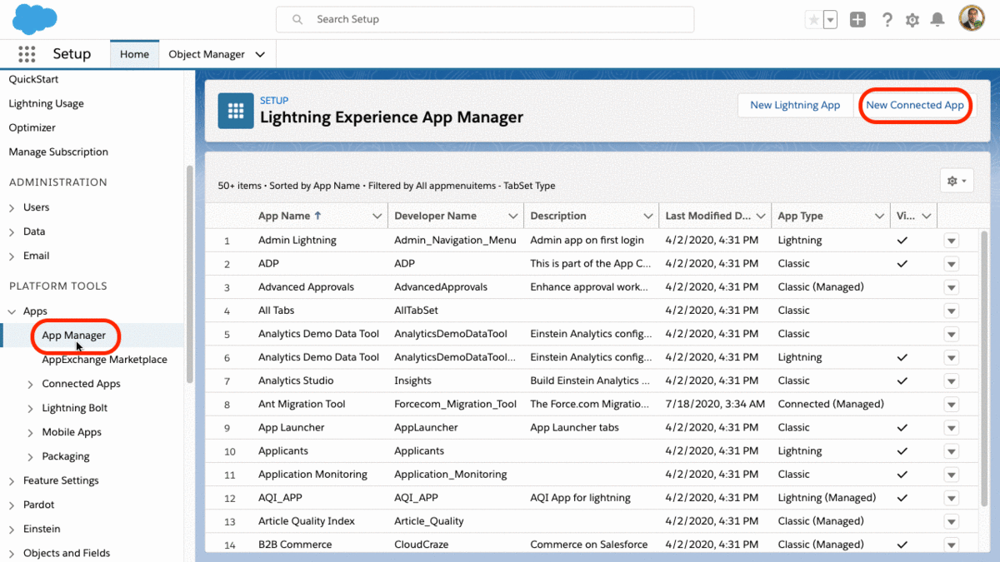
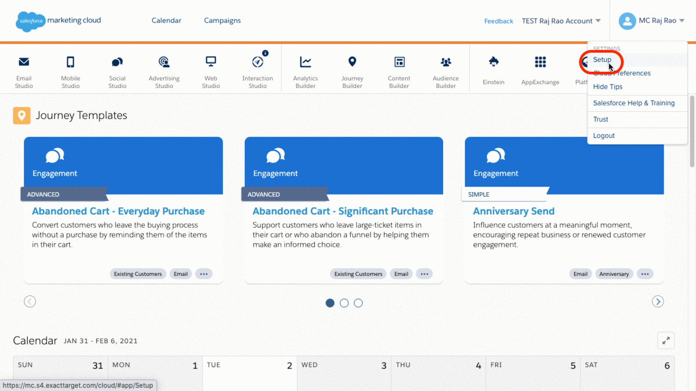
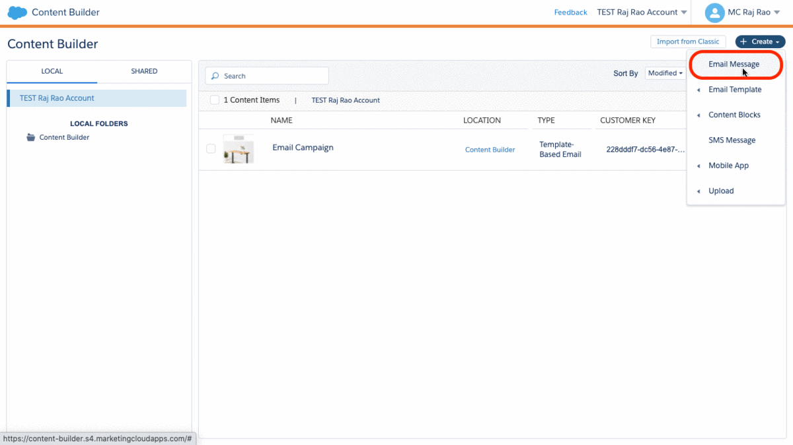

# Content Builder SDK - Salesforce CMS Selector

## App Overview

This SDK app provides a way select a Salesforce CMS image, take additional input from the block, and render the image in the email.



This Content Block SDK app provides a way to select a Salesforce CMS content based on image, news, or document content types via a channel, take additional input from the block, and render the image in the email.

- The application is written in Node.js. Express is used as the framework with [EJS](https://github.com/mde/ejs) as the view engine. Leveraged [Salesforce Lightning Design System](https://github.com/salesforce-ux/design-system) for the User Interface, and [Salesforce Marketing Cloud Block SDK](https://github.com/salesforce-marketingcloud/blocksdk) for interacting with Content Builder.
- 3 Total Routes - 1 View
  - index - home page for app that provides the interface the user will engage with.
  - getCMSDocuments - retrieves cms documents based on the standard cms_document content type for the specified channelId.
  - getCMSImages - retrieves cms images based on the standard cms_image content type for the specified channelId.
  - getCMSNews - retrieves cms news based on the standard news content type for the specified channelId.

## Prerequisites

- Salesforce org with CMS enabled
- Salesforce CMS Workspace
- Marketing Cloud Account
- GitHub Account
- Heroku Account

## Setup Instructions

- Step 1: [Create a headless Marketing Cloud channel in Salesforce CMS for integration with Marketing Cloud](#create-a-headless-marketing-cloud-channel-in-salesforce-cms-for-integration-with-marketing-cloud)
- Step 2: [Author content in Salesforce CMS Workspace](#author-content-in-salesforce-cms-workspace)
- Step 3: [Create a Private Key and Self-Signed Digital Certificate](#create-a-private-key-and-self-signed-digital-certificate)
- Step 4: [Create a user account](#create-a-user-account)
- Step 5: [Create a Connected App](#create-a-connected-app)
- Step 6: [Deploy the GitHub Repo to Heroku](#deploy-the-github-repo-to-heroku)
- Step 7: [Create a Package in Marketing Cloud](#create-a-package-in-marketing-cloud)
- Step 8: [Create an email message in Marketing Cloud Content Builder and use CMS content](#create-an-email-message-in-marketing-cloud-content-builder-and-use-cms-content)

### Create a headless Marketing Cloud channel in Salesforce CMS for integration with Marketing Cloud

1. From the Salesforce App Launcher, open Salesforce CMS
2. From the CMS Home tab, select **CMS Channels**
3. Click **Add Channel** | **Create Channel**
4. Name the channel: **Marketing Channel**
5. Select the connection type: **Public**
6. Click **Create**
7. From **CMS Workspaces**, select the workspace where you want to add the **Marketing Channel** created in the previous step
8. Click **Add Channel** to share content created in this workspace
9. Select the **Marketing Channel.** Then click **Add**
10. Login to [Workbench](https://workbench.developerforce.com/) to retrieve the Marketing Channel Id
    1. From Workbench go to **Utilities | Rest Explorer**
    2. Choose the **GET** http method with this service URI: **/services/data/v51.0/connect/cms/delivery/channels**
    3. Click on **Execute**
    4. Click on **Expand All** and **copy** the **channelId** for the channelName: **Marketing Channel**
    5. We will use the copied channelId later

You can use the content in a public channel for emails, websites, custom apps, and more. To share your Salesforce CMS content with your endpoints, [Add a Channel to a CMS Workspace](https://help.salesforce.com/articleView?id=cms_cmsworkspace-adddestination.htm&type=5).



### Author Content in Salesforce CMS Workspace

1. In the Salesforce CMS app, open the workspace associated with the public channel: **Marketing Channel**. Click **Add Content**
2. Select the content type: **Document, Image, or News**. Then click **Create**
3. Fill in the fields. Click **Save Draft** when finished
4. Click **Publish**

Here’s how your new content in Salesforce CMS should look. Your content is now ready for sending in an email marketing campaign.



### Create a Private Key and Self-Signed Digital Certificate

📖 [Create a Private Key and Self-Signed Digital Certificate](https://developer.salesforce.com/docs/atlas.en-us.sfdx_dev.meta/sfdx_dev/sfdx_dev_auth_key_and_cert.htm)

We will use the [OAuth 2.0 JWT bearer flow](https://help.salesforce.com/articleView?id=sf.remoteaccess_oauth_jwt_flow.htm&type=5) for server to server integration between Salesforce CMS and Marketing Cloud. The OAuth 2.0 JWT bearer authorization flow requires a digital certificate and the private key used to sign the certificate. You upload the digital certificate to the custom connected app that is also required for the JWT bearer authorization flow. You can use your own private key and certificate issued by a certification authority. Alternatively, you can use OpenSSL to create a key and a self-signed digital certificate.

If necessary, install [**OpenSSL**](https://www.openssl.org/) on your computer.

1. To check whether OpenSSL is installed on your computer, In Terminal or a Windows command prompt, run this command.

```zsh
which openssl
```

2. Create a directory to store the generated files, and change to the directory.

```zsh
cd ..
mkdir certificates
cd certificates
```

3. From within the certificates folder, generate an RSA private key

```zsh
openssl genrsa -des3 -passout pass:SomePassword -out server.pass.key 2048
```

4. Create a key file from the server.pass.key file

```zsh
openssl rsa -passin pass:SomePassword -in server.pass.key -out server.key
```

5. Delete the server.pass.key

```zsh
rm server.pass.key
```

6. Request and generate the certificate

```zsh
openssl req -new -key server.key -out server.csr
```

7. Enter all requested information. Enter a period (.) to skip entering an optional company name.

8. Generate the SSL certificate

```zsh
openssl x509 -req -sha256 -days 365 -in server.csr -signkey server.key -out server.crt
```

You should now have the server.crt, server.csr, and server.key files created. The self-signed SSL certificate server.crt is generated from the server.key private key and server.csr files. The server.crt file is your site certificate, suitable for use with the connected app along with the server.key private key. We’ll use these files soon.

### Create a User account

1. Create a new Salesforce User called **CMS User** | Assign the **Standard User** Profile | **Save**
2. Open Salesforce CMS from the App Launcher and select the workspace associated with the **Marketing Channel**
3. Select **Contributors** and click **Add Contributors**.
4. Search for and select the **CMS User | Next |** Assign the **Content Admin** role | **Finish**

### Create a Connected App

To access the content created in Salesforce CMS via API for a seamless integration, [Create a connected App,](https://help.salesforce.com/articleView?id=connected_app_create.htm&type=5) which allows invocation of the Salesforce API via OAuth from a NodeJS App hosted on Heroku.

1. From Setup, enter App Manager in the Quick Find box, then select **App Manager**
2. Click **New Connected App**
3. Enter the connected app name and email address:
   1. Connected App Name: **CMS for Marketing Cloud**
   2. Contact Email: Enter the email address associated with the **CMS User**
4. Select **Enable OAuth Settings**.
5. Enter the callback URL: [http://localhost](http://localhost/) (we will not use the callback URL, however this is a required field and needs a url)
6. Select **Use digital signatures**
7. To upload your server.crt file, click **Choose File**
8. For OAuth scopes, add:

   - Access and manage your data (api)
   - Perform requests on your behalf at any time (refresh_token, offline_access)
   - Provide access to your data via the Web (web)

9. Click **Save**

**Note**: Be sure to copy the consumer key shown below (blurred), you’ll use it later.



After you’ve saved your connected app, **Edit Policies** to enable the connected app to circumvent the manual login process.

1. Click the **Manage** button.
2. Click **Edit Policies** button.
3. In the OAuth policies section, for Permitted Users select **Admin approved users are pre-authorized**, then click **OK**.
4. Click **Save**.

Lastly, create a permission set and assign pre-authorized users for this connected app.

1. From Setup, enter Permission in the Quick Find box, then select **Permission Sets**.
2. Click **New**.
3. For the Label, enter: **CMS Connected App Permission Set**
4. Click **Save**.
5. Click **Manage Assignments** | **Add Assignments**.
6. Select the checkbox next to **CMS User**. Assign the **CMS Connected App Permission Set**, then click **Assign** | **Done**
7. Go back to your permission set, under the Apps Section click **Assign Connected Apps** | **Edit** | **Select CMS for Marketing Cloud** | **Save**

### Deploy the GitHub Repo to Heroku

This sample Node.js app demonstrates how to pull Salesforce CMS data into Marketing Cloud Content Builder using the Block SDK and is not an official tool. This approach allows for seamless integration.

1. Click the Deploy to Heroku button to deploy to your Heroku account.

<a href="https://www.heroku.com/deploy/?template=https://github.com/salesforce-marketingcloud/salesforce-cms-content.git">
  
</a>

During setup configure the following environment values:

- channelID: Enter the Salesforce CMS channelID copied earlier
- clientID: Enter the Consumer Key from your Connected App
- cmsUser: Enter the Salesforce CMS Username
- instanceURL: Enter the Salesforce login URL - [https://login.salesforce.com](https://login.salesforce.com/) or [https://test.salesforce.com](https://test.salesforce.com/)
- limit: Enter the number of CMS records to display (default is 25, max 100)
- privateKey: Copy the contents of the server.key file

### Create a Package in Marketing Cloud

Marketing Cloud [Content Builder](https://help.salesforce.com/articleView?id=000263735&r=https%3A%2F%2Fwww.google.com%2F&type=1) is a cross-channel content building system for creating, managing, and editing content. It's designed to work in the way your team works — whether in code or via plug-n-play HTML.

1. In Marketing Cloud setup, create a new package by going to **Setup** | **Installed Packages** | **New**
2. Enter a Name, Description and **Save**
3. Click **Add Component** | **Select Custom Content Block** | **Next**
4. Enter the component Name, Description, and Endpoint URL (URL of your Heroku app) then **Save**



### Create an email message in Marketing Cloud Content Builder and use CMS content

Start creating the Email from the content builder. Select a template of your choice and then click on the content type icon (Images, Docs, or News) to see the Salesforce CMS content. Add content into the [Email template](https://help.salesforce.com/articleView?id=mc_ceb_create_emails.htm&type=5) suitable for the campaign by clicking on the CMS resource.


